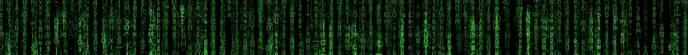

>
># Encantado, soy **Fran** : [LinkdIn](https://www.linkedin.com/in/fran-ruiz-guerra/) 
>Data Science | Data Analyst | Agricultural Engineering 
>
>
>
> I'm Francisco Javier Ruiz Guerra, but you can call me Fran. I believe that the road to sustainability is not possible without digitization, so from my background in Agricultural Engineering I like to work at the forefront of technology. 🌱 🌳  💻
>
>## SKILLS:
>* Python 
>* SQL - Structured Query Language
>* Analytical Skills
>* Data Visualization Skills
>* Problem Solving Skills
>* Business Intelligence
>
>---
>## **Tecnologías, herramientas y conceptos fundamentales**:
> ### **Básica**:
>>* SQL
>>* Estadística fundamental
>>* Python
>>* Git
>
>### **Data Analysis**:
>>* Herramientas Python: Matplotlib, Jupyter, Seaborn, Dash,
Notebooks
>>* Tableu
>>* Accesos a diferentes tipos de datos
>>* Técnicas de exploración básica y li,pieza de datos
>>* Análisis de distribuciones de valores de las clases de
predicción. Datasets válidos y sesgados
>>* Joins
>>* Cálculo de correlaciones, medianas y medias
>>* Utilización de set de datos de entrenamiento y
validación
>>* Normalización de variables. Variables categóricas y no
categóricas
>>* Principios de Data Visualization
>
>### **Machine Learning Engineering**:
>>* Aprendizaje supervisado
>>* Aprendizaje No-Supervisado
>>* Deep Learning
>>* Series temporales
>
>### **Data Science y Negocio**:
>>* Productización de ciencia de datos
>>* Storytelling y Productos de Datos
>
### Más información sobre herramientas fundamentales:
>
| Herramienta |         Versión        |                                                              Información                                                             |                            Download                            |
|:-----------:|:----------------------:|:------------------------------------------------------------------------------------------------------------------------------------:|:--------------------------------------------------------------:|
|    Python   |          3.7.4         |                                         [Guía Python](https://docs.python.org/es/3/tutorial/)                                        | [Python](https://www.python.org/downloads/release/python-374/) |
|     SQL     | MySQL Workbench 8.0.28 |                                   [Guía MySQL](https://downloads.mysql.com/docs/refman-5.0-es.pdf)                                   |       [MySQL](https://dev.mysql.com/downloads/workbench/)      |
|     GIT     |    2.35.1.windows.2    |                                                     [GitHub](https://github.com/)                                                    |              [Git](https://git-scm.com/downloads)              |
| Estadística |           --           | [Probability and Statistics for Computer Scientists](https://www.oreilly.com/library/view/probability-and-statistics/9781439875919/) |              [O'Reilly](https://www.oreilly.com/) 
             
